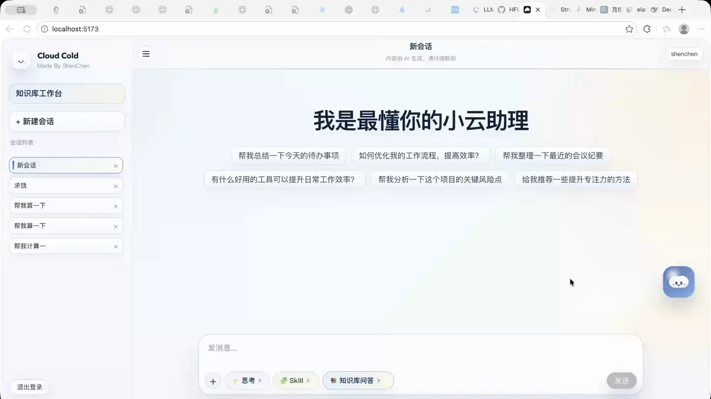

<div align="center">

# Cloud-Code 小云 AI 助理 ✨

**Cloud-Code 小云 AI 助理** — 后端服务

基于多智能体协作的 AI 对话平台，支持 Skill 工作流、HITL 人工审批、知识库 PDF 入库与检索、长期记忆 / 宠物记忆


</div>

## 🎯 核心特性

| 特性 | 说明 |
|------|------|
| 🤖 多模式 Agent | `fast` 快速模式 + `thinking` 深度思考模式 + `expert` Multi-Agent 协调者模式 |
| 🧩 Multi-Agent 协调 | Expert 模式下协调者拆解任务，Worker 并行执行，统一汇总 |
| 🧩 Skill 工作流 | 6 节点编排，自动识别相关 Skill，支持 Python 脚本执行 |
| ✋ HITL 人工审批 | 敏感操作拦截，支持批准 / 拒绝 / 修改参数后继续执行 |
| 📚 知识库 | PDF 入库、多模态解析（文本 + 图片描述）、混合检索（关键词 + 向量） |
| 🐾 长期记忆 | 向量召回相似记忆，定时扫描兜底，宠物形象情绪展示 |
| 📡 SSE 流式输出 | 思考过程、最终回答、HITL 中断、知识库命中图片实时推送 |
| 🌐 API 文档 | Knife4j 自动生成，启动即可访问 |

## 🎬 功能演示

- 思考模式 绑定 skill 执行个税脚本

  

- 思考模式 不绑定 skill 执行个税脚本

  

- 快速模式 对话问答 执行个税脚本

  

- 知识库创建

  

- 知识库检索 支持图像

  

- 个人宠物 长期记忆

  

## ✨ 功能详情

### Agent 编排

| Agent 模式 | `AgentModeEnum` | 实现类 | 特点 |
|-----------|-----------------|--------|------|
| `fast` | `FAST` | `SimpleReactAgent` | 同步循环执行 tool call，Sinks.Many SSE 流式输出 |
| `thinking` | `THINKING` | `PlanExecuteAgent` | Plan → Execute → Critique → Summarize 全流程 |
| `expert` | `EXPERT` | `CoordinatorAgent` | Multi-Agent 协调者：任务拆解 → Worker 并行执行 → 汇总 |
| `expert` 回退 | `EXPERT` | `PlanExecuteAgent` | 当 CoordinatorAgent 未就绪时自动回退 |
| 默认 | — | `SimpleReactAgent` | 未匹配时回退 |

请求主链路（`AgentServiceImpl.call()`）：

```
Skill 工作流预处理 → 知识库预检索 → 长期记忆召回 → 组装 system prompt → Agent 执行
```

SSE 事件类型：

| 事件类型 | 说明 |
|---------|------|
| `thinking_step` | Agent 思考步骤 |
| `assistant_delta` | 助手增量回答 |
| `final_answer` | 最终回答 |
| `hitl_interrupt` | HITL 中断通知 |
| `knowledge_retrieval` | 知识库命中图片回显 |
| `error` | 错误通知 |

### Multi-Agent 协调者

EXPERT 模式使用 `CoordinatorAgent` 实现多智能体协作：

1. **分析**：协调者接收用户问题，分析任务复杂度
2. **拆解**：将任务拆解为多个子任务，使用 `dispatch_to_worker` 工具派发
3. **并行执行**：`WorkerPool` 管理 Worker 池，`WorkerAgent` 独立执行（仅配备 `search` 工具）
4. **汇总**：收集所有 Worker 结果，经上下文压缩后生成最终答案

### Agent 工具池

Agent 运行时仅暴露 `commonTools`（`@Qualifier("commonTools")`），包含 2 个工具：

| 工具 | `@Tool(name=...)` | 实现类 | 说明 |
|------|-------------------|--------|------|
| `search` | `search` | `SearchTool` | 搜索（Tavily 或开发环境 mock） |
| `execute_skill_script` | `execute_skill_script` | `ExecuteSkillScriptTool` | Python 脚本执行（HITL 默认拦截目标） |

全部 9 个已注册工具（`allTools` bean，按类名排序）：

`search`、`knowledge_hybrid_search`、`knowledge_scalar_search`、`knowledge_vector_search`、`list_skill_resources`、`read_skill_resource`、`read_skill`、`dispatch_to_worker`、`execute_skill_script`

另有 2 组条件注册的工具 Bean：

| Bean 名称 | 工具 | 用途 |
|-----------|------|------|
| `coordinatorTools` | `dispatch_to_worker` | CoordinatorAgent 专用（需 `multiagent.coordinator.enabled=true`） |
| `workerTools` | `search` | WorkerAgent 专用（需 `multiagent.coordinator.enabled=true`） |

> 知识库检索工具（`knowledge_*`）只存在于 `allTools`，不在 `commonTools`。Agent 运行时无法调用，知识库检索走服务层预检索（`KnowledgePreprocessServiceImpl.preprocess()`）。

### Skill 工作流

- **项目内建 Skill**（`src/main/resources/skills`）：计算个人所得税、两数之和
- **用户自定义 Skill**（`src/main/resources/user-skills`）：可通过文件系统注册
- Skill 注册：`FileSystemSkillRegistry` 作为委托，`CachingSkillRegistry` 缓存，`SkillConfig` 装配
- 6 节点顺序工作流（`SkillWorkflowConfig`）：加载已绑定 Skill → 加载对话历史 → 识别相关性 → 发现候选 Skill → 加载 SKILL.md 内容 → 构建 `SkillRuntimeContext`
- 工作流结果 `SkillWorkflowResult` 包含 `selectedSkills` 和 `selectedSkillContexts`

### HITL 人工审批

```
工具调用 → 拦截检查 → 创建 hitl_checkpoint → SSE 推送 hitl_interrupt → 前端审批 → POST /agent/resume 恢复
```

| 审批结果 | 说明 |
|---------|------|
| `APPROVED` | 批准，继续执行 |
| `REJECTED` | 拒绝，全部拒绝时输出拒绝信息 |
| `EDIT` | 修改参数后继续执行 |

- 默认拦截工具：`execute_skill_script`（通过 `cloudcold.hitl.intercept-tool-names` 配置）。Multi-Agent 的 `dispatch_to_worker` 工具不被拦截
- `HITLState` 使用 `ConcurrentHashMap<String, Set<Long>>` 追踪已消费的 toolCallId，防止恢复后重复执行
- `AgentServiceImpl.resume()` 根据 `agentType` 路由到对应 Agent（`PlanExecuteAgent` 或 `CoordinatorAgent`）

### 知识库 PDF 入库

```
PDF 上传 → MinIO 存储 → 临时落盘 → PdfMultimodalProcessor 读取
  → 提取正文文本 + 抽取 PDF 图片 → 多模态模型（qwen3-vl-plus）生成描述
  → 图像描述注入文本原位 → 段落切分父块（PARENT）→ 子块切分（TEXT，200 字符）
→ ES 关键词索引（rag_docs，父块+子块）+ 向量索引（rag_docs_vector，仅 TEXT 子块，1536 维，cosine 相似度）
```

- 两级分块：父块（`PARENT`）含完整段落 + `metadata.imageIds`；子块（`TEXT`）含 `parentChunkId` 指向父块
- 标量检索查父块，向量检索查子块，向量结果在 RRF 融合前 resolve 回父块
- 图像描述通过 `<cloudcoldagent-image>` 标签注入文本原位，分块后剥离标签保留描述文字
- 入库同步完成，返回时已是 `INDEXED` 或 `FAILED`
- 当前仅支持 PDF，`PdfMultimodalProcessor` 是 `DocumentReaderStrategy` 的唯一实现
- 预检索链路：会话绑定 `selectedKnowledgeId` → `KnowledgeService.hybridSearch()`（最多 8 个片段、4000 字符）→ 父块 `imageIds` 查 MySQL 获取 MinIO presigned URL → SSE `knowledge_retrieval` 事件

### 长期记忆 / 宠物记忆

| 环节 | 说明 |
|------|------|
| 存储 | MySQL（`user_long_term_memory`、`user_long_term_memory_source_relation`、`user_long_term_memory_conversation_state`）+ ES 双索引（关键词 `user_long_term_memory_docs` + 向量 `user_long_term_memory_vector`，1536 维）+ Redis（宠物名称、最后学习时间） |
| 提取 | 助手消息落库后通知，同一会话累计 5 轮触发（`triggerRounds`），LLM 结构化提取 → MySQL + ES 双写 |
| 召回 | Agent 入口前向量召回（topK=5，阈值 0.5），最多 4 条注入 prompt |
| 定时 | `UserLongTermMemoryScheduler` 每小时整点扫描待处理会话 |

### 聊天记忆

- `MysqlChatMemoryRepository` 实现 `ChatMemoryRepository`，持久化到 `chat_memory_history` 表
- 窗口大小：`maxMessages=20`（`cloudcold.agent.memory.max-messages`）
- 不持久化实时思考过程，只持久化用户消息、助手最终回答和已回绑知识库图片（`ChatMemoryHistoryImageRelation`）

## 🛠 技术栈

| 技术 | 版本 | 说明 |
|------|------|------|
| Java | 21 | 运行环境 |
| Spring Boot | 3.5.13 | Web 框架 |
| Spring AI | 1.1.2 | AI Agent 框架 |
| Spring AI Alibaba | 1.1.2 | Agent 编排 + Tavily 搜索 + Python 工具调用 |
| MyBatis-Flex | 1.11.1 | ORM 框架 |
| MySQL | 8.x | 数据存储（HikariCP 连接池） |
| Redis | 6.x / 7.x | Session 存储 + 缓存 |
| Elasticsearch | 8.x | 关键词 + 向量双索引 |
| MinIO | 8.5.1 | 对象存储（PDF、图片） |
| GraalVM Polyglot | 25.0.1 | Python 脚本执行引擎 |
| Knife4j | 4.4.0 | API 文档（OpenAPI 3 + Jakarta） |
| Hutool | 5.8.43 | Java 工具集 |

## 🚀 快速开始

### 环境要求

- JDK 21+
- Maven 3.9+（或使用 `./mvnw`）
- MySQL 8.x
- Redis 6.x / 7.x
- Elasticsearch 8.x
- MinIO

### 1. 初始化数据库

```bash
mysql -uroot -p < src/main/java/com/shenchen/cloudcoldagent/database/init.sql
```

### 2. 配置密钥

编辑 `src/main/resources/application.yml`，搜索 `TODO` 并替换为你的实际配置：

```yaml
spring:
  ai:
    openai:
      api-key: your-dashscope-api-key-here   # TODO: DashScope API Key（必填）
  datasource:
    password: your-mysql-password-here        # TODO: MySQL 密码（必填）

minio:
  accessKey: your-minio-access-key-here       # TODO: MinIO 凭证（必填）
  secretKey: your-minio-secret-key-here

  # 可选
  # spring.ai.alibaba.toolcalling.tavilysearch.api-key  # TODO: Tavily 搜索 Key
```

### 3. 启动后端

```bash
./mvnw -q -DskipTests compile   # 编译检查
./mvnw spring-boot:run           # 启动服务
```

服务地址：[http://localhost:8081/api](http://localhost:8081/api)

API 文档：[http://localhost:8081/api/doc.html](http://localhost:8081/api/doc.html)


## 📁 项目结构

```
src/main/java/com/shenchen/cloudcoldagent
├── agent/                 # BaseAgent、SimpleReactAgent、PlanExecuteAgent
│   └── multiagent/        # CoordinatorAgent
│       └── worker/        # WorkerAgent、WorkerPool
├── annotation/            # @AuthCheck、@DistributeLock
├── aop/                   # AuthInterceptor、DistributeLockAspect
├── common/                # BaseResponse、AgentStreamEventFactory、ResultUtils、分页请求
├── config/                # Web、ToolRegistration、ES、MinIO、Session、RateLimiter、CORS、AgentThreadPool、Coordinator、DistributeLock、Skill
│   └── properties/        # Agent、ES、HITL、LongTermMemory、Minio、PdfMultimodal、Search、Upload 配置属性
├── constant/              # AgentConstant、DistributeLockConstant、KnowledgeChunkConstant、RedisKeyConstant、UserConstant
├── context/               # AgentRuntimeContext
├── controller/            # REST + SSE 接口（11 个 Controller）
│   ├── agent/             # AgentController
│   ├── chat/              # ChatConversationController、ChatMemoryHistoryController
│   ├── hitl/              # HitlCheckpointController
│   ├── knowledge/         # KnowledgeController、DocumentController
│   ├── user/              # UserController
│   ├── usermemory/        # UserLongTermMemoryController
│   ├── skill/             # SkillController
│   └── storage/           # EsController、FileController
├── database/              # init.sql + ES mapping JSON（es_rag_docs_mapping.json、user_long_term_memory_mapping.json）
├── document/              # 文档读取、清洗、切分、索引
│   ├── extract/cleaner/   # DocumentCleaner
│   ├── extract/reader/    # PdfMultimodalProcessor（当前唯一 DocumentReaderStrategy 实现）
│   ├── load/embedding/    # EmbeddingService
│   ├── load/store/        # StoreService
│   └── transform/splitter/# OverlapParagraphTextSplitter、ParentTextSplitter
├── enums/                 # AgentModeEnum、DocumentIndexStatusEnum、HitlCheckpointStatusEnum、UserRoleEnum、WorkerTaskStatusEnum
├── exception/             # BusinessException、DistributeLockException、ErrorCode、GlobalExceptionHandler、HitlInterruptedException
├── hitl/                  # HITLState（ConcurrentHashMap 追踪已消费 toolCallId）
├── job/                   # UserLongTermMemoryScheduler（每小时整点扫描）
├── limiter/               # SlidingWindowRateLimiter
├── mapper/                # MyBatis-Flex Mapper 接口（14 个）
│   ├── chat/              # ChatConversationMapper、ChatMemoryHistoryMapper 等（6 个）
│   ├── hitl/              # HitlCheckpointMapper
│   ├── knowledge/         # KnowledgeMapper、KnowledgeDocumentImageMapper、DocumentMapper
│   ├── user/              # UserMapper
│   └── usermemory/        # UserLongTermMemoryMapper 等（3 个）
├── memory/store/          # MysqlChatMemoryRepository（聊天记忆 MySQL 持久化）
├── model/
│   ├── dto/               # 请求 DTO（agent/、chat/、document/、hitl/、knowledge/、skill/、user/、usermemory/）
│   ├── entity/            # 数据库实体（agent/、hitl/、knowledge/、user/、usermemory/）
│   │   └── record/        # Agent 执行记录（agent/knowledge/、agent/multiagent/、agent/planexecute/、hitl/、knowledge/、support/）
│   └── vo/                # 视图对象（agent/、hitl/、knowledge/、skill/、user/、usermemory/）
├── prompts/               # System Prompt（BaseAgentPrompts、PlanExecutePrompts、ReactAgentPrompts、KnowledgePrompts、SkillWorkflowPrompts、UserLongTermMemoryPrompts）
│   └── multiagent/        # CoordinatorPrompts、WorkerPrompts
├── registry/              # SkillRegistry、CachingSkillRegistry、FileSystemSkillRegistry
├── service/               # 业务接口（24 个）+ 实现（24 个）
│   ├── agent/             # AgentService
│   ├── chat/              # ChatConversationService、ChatMemoryHistoryService 等（7 个）
│   ├── hitl/              # HitlCheckpointService、HitlExecutionService、HitlResumeService
│   ├── knowledge/         # KnowledgeService、KnowledgePreprocessService、DocumentService 等（5 个）
│   ├── user/              # UserService
│   ├── skill/             # SkillService
│   ├── storage/           # ElasticSearchService、MinioService
│   └── usermemory/        # 长期记忆服务接口 + 实现（4 对）
├── tools/                 # Agent Tools
│   ├── BaseTool.java      # 工具抽象基类
│   ├── common/            # SearchTool
│   ├── multiagent/        # WorkerDispatchTool
│   ├── rag/               # AbstractKnowledgeSearchTool、KnowledgeHybridSearchTool、KnowledgeScalarSearchTool、KnowledgeVectorSearchTool
│   └── skill/             # ExecuteSkillScriptTool、ListSkillResourcesTool、ReadSkillResourceTool、ReadSkillTool
├── utils/                 # 工具类（DeleteExceptionUtils、HitlSerializationUtils、JsonUtil、PythonScriptRuntimeUtils 等）
├── workflow/skill/        # Skill 工作流
│   ├── config/            # SkillWorkflowConfig（6 节点顺序图）
│   ├── node/              # 6 个 Node 实现
│   ├── state/             # SkillRuntimeContext、SkillExecutionPlan 等状态对象
│   └── service/           # SkillWorkflowService + StructuredOutputAgentExecutor
```

## 📖 文档

- [AGENTS.md](AGENTS.md) — 项目地图与规则（AI 工具入口）
- [docs/architecture.md](docs/architecture.md) — 分层架构、核心链路、接口概览、长期记忆架构
- [docs/development.md](docs/development.md) — 本地环境、配置、启动、验证、排查
- [docs/design-docs/ref-backend-architecture.md](docs/design-docs/ref-backend-architecture.md) — 参考项目架构说明
- [docs/design-docs/backend-patterns.md](docs/design-docs/backend-patterns.md) — 后端组件、Tool、Skill、文档、长期记忆模式
